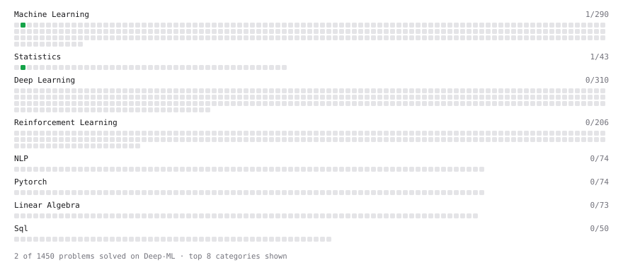

# Deep-ML

My machine learning practice from [Deep-ML](https://www.deep-ml.com). Every solution here was written by hand.

**4** solved · 1 problems · 0 labs · 3 math

[**Browse the interactive portfolio**](https://Fun12568.github.io/deep-ml/) to replay this filling in over time.

## Problems

| | Difficulty | Solved | |
| --- | --- | --- | --- |
| [Linear Regression Using Gradient Descent](https://www.deep-ml.com/problems/15) | easy | 2026-09-27 | [solution](problems/0015-linear-regression-using-gradient-descent) |

## Math

| | Difficulty | Solved | |
| --- | --- | --- | --- |
| [Descriptive Statistics](https://www.deep-ml.com/math-problems/18) | easy | 2026-09-27 | [solution](math/0018-descriptive-statistics) |
| [Expectation and Variance Algebra](https://www.deep-ml.com/math-problems/33) | easy | 2026-09-27 | [solution](math/0033-expectation-and-variance-algebra) |
| [Probability Fundamentals](https://www.deep-ml.com/math-problems/19) | easy | 2026-09-27 | [solution](math/0019-probability-fundamentals) |

---

_This file is regenerated by Deep-ML on every push._
